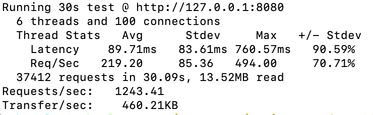
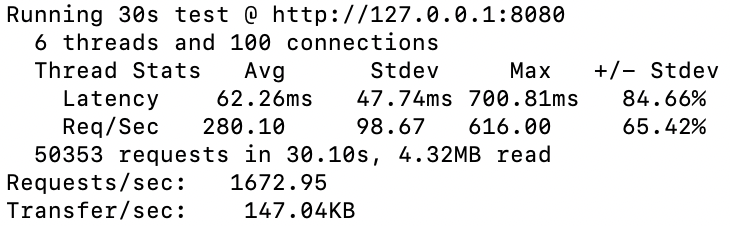

# TT_assignment_2023


## Overview

This GitHub repository contains a completed assignment regarding a backend instant messaging system with one HTTP server and one RPC server. Two APIs are implemented in the system (SEND and PULL). The demo and template for the assignment can be found [here](https://github.com/TikTokTechImmersion/assignment_demo_2023). Note that the RPC IDL was not changed.

On top of the template code, the following implementations are completed:

1. Data storage was added. Redis (Key-Value DB) was utilized.
    * When a message is sent via the send API, the message has to be stored in the database.
    * The key is the chatroom name while the value is the marshalled message.
    * Redis sorted set data structure was utilized (ordered by timestamp of messages).

2. Pull API was implemented to fetch messages from DB. 
    * Ensured that L messages are returned starting from the cursor, where L refers to the limit passed by the caller. 
    * Ensure that the order of messages returned can be reversed using the reverse parameter in the pull API.

3. Performance testing.
    * wrk, a modern HTTP benchmarking tool, is utilized.
    * A benchmark for 30 seconds, using 6 threads, and keeping 100 HTTP connections open was run for both send (obtained 1672 requests/sec) and pull (obtained 1243 requests/sec) APIs.

***

## How to use the APIs with sample requests and responses

To send a message to a chat.

- POST /api/send
- Response: Nil (unless error)


| Param         | Type           | Description  |
| ------------- |:-------------:| -----:|
| chat          | string      | Name of chatroom. |
| text          | string      |   A text message being sent. |
| sender        | string      |    Sender name. |
| sendtime      | int64       | Timestamp (auto-added when send API is called).|

Example curl command:

```shell
curl --request POST \
  --url http://localhost:8080/api/send \
  --header 'Content-Type: application/json' \
  --data '{
	"chat": "chatroom12345",
	"text": "hi guys! :) ",
	"sender": "kylie"
}'
```

To get messages in a chatroom.

- GET /api/pull

| Param         | Type           | Description  |
| ------------- |:-------------: | -----:|
| chat          | string         | Name of chatroom. |
| cursor        | int64       |   Starting point (timestamp) of messages to retrieve, 0 by default (if not indicated). |
| limit         | int32       |    The number of messages to return. |
| reverse       | bool        | To reverse the order of messages returned. If true, the messages will be ordered from oldest to newest.|

Example curl command:

```shell
curl --request GET \
  --url http://localhost:8080/api/pull \
  --header 'Content-Type: application/json' \
  --data '{
	"chat": "chatroom12345",
	"cursor": 0,
	"limit": 3,
	"reverse": false
}'
```


- Response:

| Field         | Type           | Description  |
| ------------- |:-------------:| -----:|
| messages      | array      | A sorted array of messages. |
| has_more      | bool       | If true, indicates there may be more messages in the chatroom that has not been fetch. |
| next_cursor   | int64      |    Starting position of next page if want to fetch more messages. |


```json
{
	"messages": [
		{
			"chat": "chatroom12345",
			"text": "hi guys! :) ",
			"sender": "kylie",
			"send_time": 1686481639
		},
		{
			"chat": "chatroom12345",
			"text": "hello to everyone :) ",
			"sender": "jimmy",
			"send_time": 1686481618
		},
		{
			"chat": "chatroom12345",
			"text": "hello from mary :) ",
			"sender": "mary",
			"send_time": 1686481600
		}
	],
	"has_more": true,
	"next_cursor": 1686481600
}
```

***

## Performance test

The results shown were tested on docker on MacOS with 4 CPU cores and 4GB of Memory.

Pull API
```shell
wrk -t6 -c100 -d30s -s ./scripts/wrk-pull.lua http://127.0.0.1:8080
```


Send API
```shell
wrk -t6 -c100 -d30s -s ./scripts/wrk-send.lua http://127.0.0.1:8080
```



